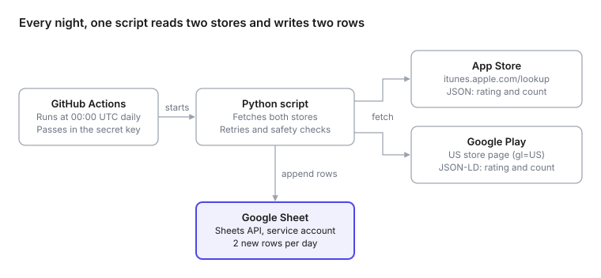

Every night at midnight UTC, a small Python script records the Specialized app's star rating and rating count from the App Store and Google Play, and adds two rows to a Google Sheet. It runs free on GitHub Actions and needs no server.

## The goal

App store ratings change slowly, and neither store keeps a public history. If you want a trend line, you have to record it yourself, every day. I wanted two rows a day, one per store:

| Date | Source | Rating | Rating Count | Country |
| --- | --- | --- | --- | --- |
| 9/30/2026 | app store | 4.73583 | 11368 | US |
| 9/30/2026 | google play | 4.577777862548828 | 11001 | US |

- **Date** is the UTC day the data was collected.
- **Rating** is kept at full precision. You can always round later, but you can't get lost decimals back.
- **Rating Count** is the number of star ratings, not written reviews. Neither store publishes a comparable count of written reviews.

## How it fits together

{fig-alt="Diagram: GitHub Actions starts a Python script at 00:00 UTC; the script fetches the rating and rating count from the App Store and Google Play, then appends two rows to a Google Sheet."}

GitHub starts the job at midnight UTC. The script reads each store's public data, then writes both rows to the sheet through the Google Sheets API.

## Getting the data

The two stores needed completely different approaches. Apple has a public API. Google has none, but its store page contains the numbers in a machine-readable form.

### App Store: a public lookup API

Apple's iTunes Search API returns an app's details as JSON, with no key or login. You pass the app's ID (the number at the end of its App Store URL) and a country code:

```
https://itunes.apple.com/lookup?id=1587051382&country=us
```

The response has the two fields I need:

```json
{
  "resultCount": 1,
  "results": [{
    "trackName": "Specialized",
    "averageUserRating": 4.73583,
    "userRatingCount": 11368
  }]
}
```

In Python, that's a single request:

```python
import requests

resp = requests.get(
    "https://itunes.apple.com/lookup",
    params={"id": 1587051382, "country": "us"},
    timeout=30,
)
app = resp.json()["results"][0]
print(app["averageUserRating"], app["userRatingCount"])  # 4.73583 11368
```

### Google Play: structured data in the page

Google Play has no public ratings API. But every app page includes a small block of [schema.org](https://schema.org/AggregateRating) JSON that search engines read, and the rating is in it:

```html
<script type="application/ld+json">
{
  "@type": "SoftwareApplication",
  "name": "Specialized",
  "aggregateRating": {
    "ratingValue": "4.577777862548828",
    "ratingCount": "11001"
  }
}
</script>
```

The script downloads the page for the US store (`gl=US`) and reads that block:

```python
import json, re, requests

html = requests.get(
    "https://play.google.com/store/apps/details",
    params={"id": "com.specialized.android", "hl": "en_US", "gl": "US"},
    headers={"User-Agent": "Mozilla/5.0"},
    timeout=30,
).text

for block in re.findall(r'<script type="application/ld\+json"[^>]*>(.*?)</script>', html, re.S):
    data = json.loads(block)
    if data.get("@type") == "SoftwareApplication":
        rating = data["aggregateRating"]
        print(rating["ratingValue"], rating["ratingCount"])  # 4.5777... 11001
```

Reading the page is less stable than an official API, so the script checks what it finds. If the block is missing or the numbers look wrong, it fails loudly instead of writing bad data.

## Writing to Google Sheets

Reading the stores needs no login, because the data is public. Writing to a private Google Sheet at midnight, with nobody logged in, needs three things set up once:

| Piece | What it is | Why it's needed |
| --- | --- | --- |
| Google Cloud project | A free container for API usage | Google ties every API request to a project |
| Google Sheets API | The entry point programs use to read and write Sheets | Every Google API is off by default and has to be switched on per project |
| Service account | A robot Google account with a JSON key as its password | Something has to log in, and it shouldn't be your personal account |

A new service account can't see anything. You give it access by sharing the sheet with its email address (something like `sheets-writer@my-project.iam.gserviceaccount.com`) as an Editor, exactly as you would with a person. It gets that one sheet and nothing else in your Drive.

With the key in hand, the [gspread](https://docs.gspread.org/) library makes the write short:

```python
import gspread, json, os

client = gspread.service_account_from_dict(
    json.loads(os.environ["GCP_SA_KEY"]),
    scopes=["https://www.googleapis.com/auth/spreadsheets"],
)
sheet = client.open_by_key("YOUR_SHEET_ID").worksheet("Sheet1")

sheet.append_rows(
    [["2026-09-30", "app store", 4.73583, 11368, "US"],
     ["2026-09-30", "google play", 4.577777862548828, 11001, "US"]],
    value_input_option="USER_ENTERED",  # so "2026-09-30" becomes a real date
)
```

`USER_ENTERED` tells Sheets to treat the values as if typed by hand. That means the date is stored as a real date you can sort and chart, not as text.

## Running it every night

GitHub Actions can run a script on a schedule, on GitHub's own machines, for free. The whole job is one file in the repo at `.github/workflows/`:

```yaml
name: App daily ratings

on:
  schedule:
    - cron: "0 0 * * *"   # every day at 00:00 UTC
  workflow_dispatch:       # adds a "Run workflow" button for manual runs

jobs:
  collect:
    runs-on: ubuntu-latest
    steps:
      - uses: actions/checkout@v7
      - uses: actions/setup-python@v7
        with:
          python-version: "3.11"
      - run: pip install -r requirements.txt
      - run: python app_daily_ratings.py
        env:
          GCP_SA_KEY: ${{ secrets.GCP_SA_KEY }}
```

The service account's JSON key goes in the repo's **Settings → Secrets and variables → Actions** as `GCP_SA_KEY`. GitHub hands it to the script at run time and hides it in the logs, so it never appears in the code.

Two details to know:

- Scheduled workflows only run from the default branch (usually `main`), so nothing happens until the file is merged there.
- The run takes under a minute, which is well inside the free Actions allowance, even for a private repo.

## Making it trustworthy

A daily dataset is only useful if every row can be trusted. Four small rules do most of the work:

| Rule | What it prevents | Example |
| --- | --- | --- |
| **Retry each source 3 times** | A one-off timeout costing a day of data | Apple times out at 00:00:05; the retry 10 seconds later succeeds |
| **All or nothing** | Half-filled days | Google Play fails 3 times: nothing is written, the run goes red, and GitHub emails me |
| **Skip duplicates** | Double rows from re-runs | I click "Run workflow" twice on the same day; the second run sees both rows and adds nothing |
| **Check the header first** | Numbers landing in the wrong columns | Someone swaps two columns; the script refuses to write until the header matches again |

The fix for a missed day is always the same: click **Run workflow** before the UTC day ends. The duplicate check means it only fills in what's missing.

## What I learned

**Ratings are local, and stores disagree on what "local" means.** Each App Store country has its own ratings: 11,368 in the US, 7,283 in Germany, 334 in Japan. Google Play is only half local. The rating changes by country (4.58 US, 4.23 Germany, 3.75 Japan), but every country's page shows the same worldwide count of 11,001. So my Google Play row pairs the US rating with the worldwide count, the same pairing the Play page itself shows. A country-by-country Play count simply doesn't exist.

**"The caller does not have permission" means the login worked.** My first real run failed with a 403 error. The key was fine and the API was on. I just hadn't shared the sheet with the service account's email address. One click on Share fixed it.

**Scheduled doesn't mean punctual.** Midnight UTC is one of GitHub's busiest times, so runs often start 5–30 minutes late. That's why the Date column records the day the run actually happened, not the day it was meant to.

**Test with a dry run first.** A `--dry-run` flag that fetches and prints the rows without touching the sheet let me check the store data before any Google setup existed. When the real run failed, I already knew the problem was on the Sheets side.
